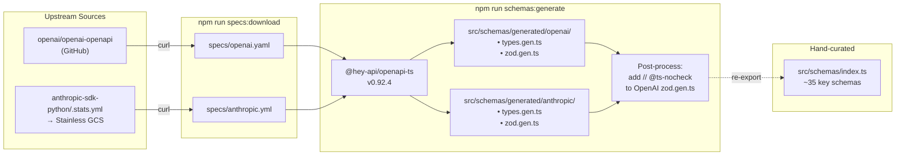

# Auto-Generating Zod Schemas from OpenAPI Specs

## Why This Matters

HydraTeams translates between Anthropic and OpenAI API formats. Until now, we relied on hand-written TypeScript interfaces in `src/translators/types.ts` with **zero runtime validation**. If an upstream API changes a field name or adds a required property, our proxy silently forwards garbage.

Zod schemas give us:
- **Runtime validation** via `safeParse()` — catch malformed payloads before they cause cryptic downstream errors
- **Single source of truth** — generated from the official OpenAPI specs, not guesswork
- **Test fixtures** — validate that our hand-crafted test data matches the real API contract

---

## Architecture: Where Schemas Fit

```
┌─────────────────────────────────────────────────────────────────────┐
│                        HydraTeams Project                          │
│                                                                     │
│  specs/                        src/                                 │
│  ├── anthropic.yml   ──────▶  schemas/                              │
│  └── openai.yaml     ──────▶  ├── generated/                       │
│       (gitignored)             │   ├── anthropic/                   │
│                                │   │   ├── types.gen.ts             │
│                                │   │   └── zod.gen.ts               │
│                                │   └── openai/                      │
│                                │       ├── types.gen.ts             │
│                                │       └── zod.gen.ts               │
│                                ├── index.ts  ◀── curated barrel     │
│                                └── __tests__/                       │
│                                    └── schemas.test.ts              │
│                                                                     │
│  translators/                                                       │
│  ├── types.ts  ◀── existing hand-written interfaces (kept as-is)   │
│  ├── request.ts                                                     │
│  └── response.ts                                                    │
└─────────────────────────────────────────────────────────────────────┘
```

The generated schemas **supplement** the existing hand-written types — they don't replace them (yet).

---

## The Codegen Pipeline



One command does it all:

```
npm run schemas:update
       │
       ├── npm run specs:download          (scripts/download-specs.sh)
       │      ├── fetch .stats.yml → extract openapi_spec_url
       │      ├── curl → specs/anthropic.yml   (Stainless-hosted, ~592 KB)
       │      └── curl → specs/openai.yaml     (GitHub, ~1.3 MB)
       │
       └── npm run schemas:generate
              ├── openapi-ts (reads openapi-ts.config.ts)
              │      ├── Job 1: anthropic.yml → src/schemas/generated/anthropic/
              │      └── Job 2: openai.yaml   → src/schemas/generated/openai/
              │
              └── node post-process: prepend // @ts-nocheck to OpenAI zod.gen.ts only
```

---

## Step-by-Step Implementation

### Step 1: Install Dependencies

```bash
npm install -D -E @hey-api/openapi-ts   # codegen tool (pinned: 0.92.4)
npm install -D -E zod                    # runtime schema library (pinned: 4.3.6)
npm install -D -E vitest                 # test runner (pinned: 4.0.18)
```

**Why `-E` (exact)?** `@hey-api/openapi-ts` is pre-1.0 — breaking changes happen between minor versions. Exact pinning prevents surprise breakage on `npm install`.

**Why devDep for zod?** The schemas are only used in tests for now. When `proxy.ts` starts using `safeParse()` at runtime, zod moves to a regular dependency.

### Step 2: Create `specs/` Directory

```bash
mkdir -p specs
```

Created `specs/README.md` to document the two spec sources:

| Spec | Source | How resolved | Format |
|------|--------|-------------|--------|
| `openai.yaml` | `openai/openai-openapi` (`manual_spec` branch) | Direct raw URL | OpenAPI 3.x YAML |
| `anthropic.yml` | Stainless-hosted GCS (same spec that generates official SDKs) | Dynamically from `anthropic-sdk-python/.stats.yml` | OpenAPI 3.1 YAML |

### Step 3: Update `.gitignore`

Added:

```gitignore
# Downloaded OpenAPI specs (re-downloadable via `npm run specs:download`)
specs/*
!specs/README.md
```

**Why gitignore specs but commit generated code?**

```
                     gitignored?    why?
                     ──────────     ──────────────────────────────────
specs/*.json|yaml    YES            large (40K+ lines), re-downloadable
src/schemas/gen/**   NO             avoids forcing codegen before build
```

### Step 4: Add npm Scripts

```json
{
  "specs:download": "bash scripts/download-specs.sh",
  "schemas:generate": "openapi-ts && <post-process>",
  "schemas:update": "npm run specs:download && npm run schemas:generate",
  "test": "vitest run",
  "test:watch": "vitest"
}
```

The `specs:download` script (`scripts/download-specs.sh`) dynamically resolves the Anthropic spec URL by fetching `.stats.yml` from the official SDK repo — so it always gets the latest version.

The `schemas:generate` script has a post-processing step that prepends `// @ts-nocheck` to the OpenAI `zod.gen.ts` file only (Anthropic compiles clean). More on why in the [Gotchas](#gotcha-ts-nocheck) section.

### `openapi-ts` CLI Reference

`@hey-api/openapi-ts` installs a binary called `openapi-ts` into `node_modules/.bin/`. This is the same mechanism used by `tsc`, `vitest`, `tsx`, etc. — npm scripts automatically resolve binaries from `node_modules/.bin/`, so `"schemas:generate": "openapi-ts"` just works. You can also run it directly via `npx openapi-ts`.

**Two ways to use it:**

**1. Config file (recommended, what we use):**
```bash
openapi-ts                     # auto-discovers openapi-ts.config.ts
openapi-ts -f my-config.ts     # custom config path
```

When run with no args, it searches the project root for config files in this order:
`openapi-ts.config.ts` → `.cjs` → `.mjs` → `.js`

**2. Inline CLI flags (handy for one-off runs):**
```bash
npx openapi-ts \
  -i ./specs/anthropic.yml \
  -o ./src/schemas/generated/anthropic \
  -p @hey-api/typescript zod
```

**Full CLI flags:**

```
┌────────────────────────┬──────────────────────────────────────────────────────┐
│ Flag                   │ Meaning                                              │
├────────────────────────┼──────────────────────────────────────────────────────┤
│ -i, --input <path...>  │ OpenAPI spec location (file path, URL, or Hey API   │
│                        │ registry shorthand like "org/project")               │
│ -o, --output <path...> │ Output folder for generated files                    │
│ -p, --plugins [names]  │ Space-separated plugin names                         │
│                        │ e.g. -p @hey-api/typescript zod                      │
│ -c, --client <name>    │ HTTP client to generate (e.g. @hey-api/client-fetch) │
│ -f, --file <path>      │ Path to config file (overrides auto-discovery)       │
│ -w, --watch [interval] │ Watch mode — regenerate when input file changes      │
│ -d, --debug            │ Enable debug logging                                 │
│ -s, --silent           │ Suppress all output                                  │
│ -l, --logs <path>      │ Custom logs folder path                              │
│ --no-log-file          │ Disable log file output                              │
│ --dry-run              │ Parse and validate, but skip writing files            │
│ -V, --version          │ Print version number                                 │
│ -h, --help             │ Show help                                            │
└────────────────────────┴──────────────────────────────────────────────────────┘
```

We use the config file approach because we have two jobs (Anthropic + OpenAI) with per-plugin options (`definitions: true`, `requests: false`, etc.) — that would be unwieldy as CLI args. The config file also gives full TypeScript type safety via `defineConfig()`.

### Step 5: Create `openapi-ts.config.ts`

```typescript
import { defineConfig } from '@hey-api/openapi-ts';

export default defineConfig([
  {
    input: './specs/anthropic.yml',
    output: './src/schemas/generated/anthropic',
    plugins: [
      { name: '@hey-api/typescript', enums: false },
      { name: 'zod', definitions: true, requests: false, responses: false },
    ],
  },
  {
    input: './specs/openai.yaml',
    output: './src/schemas/generated/openai',
    plugins: [
      { name: '@hey-api/typescript', enums: false },
      { name: 'zod', definitions: true, requests: false, responses: false },
    ],
  },
]);
```

Key configuration choices:

```
┌──────────────────────┬───────────────────────────────────────────────┐
│ Option               │ Why                                           │
├──────────────────────┼───────────────────────────────────────────────┤
│ defineConfig([...])  │ Array syntax — one job per spec               │
│ enums: false         │ No runtime enum objects, types only           │
│ definitions: true    │ Generate schemas for #/components/schemas     │
│ requests: false      │ Skip per-endpoint request wrappers            │
│ responses: false     │ Skip per-endpoint response wrappers           │
│ input: './specs/...' │ MUST use ./ prefix — bare paths are           │
│                      │ interpreted as Hey API cloud shorthands       │
└──────────────────────┴───────────────────────────────────────────────┘
```

### Step 6: Download Specs & Run Codegen

```bash
npm run schemas:update
```

Output:

```
@hey-api/openapi-ts v0.92.4

[Job 1] Generating from 1 input:
[Job 1]   [1] ./specs/anthropic.yml
[Job 2] Generating from 1 input:
[Job 2]   [1] ./specs/openai.yaml
[Job 1] Done! Your output is in ./src/schemas/generated/anthropic
[Job 2] Done! Your output is in ./src/schemas/generated/openai
```

Generated file sizes show the scale difference:

```
anthropic/zod.gen.ts    168 KB   (~360 schemas)  ← Stainless-hosted spec
openai/zod.gen.ts       224 KB   (~284 schemas)
```

### Step 7: Create the Curated Barrel (`src/schemas/index.ts`)

The OpenAI spec alone has ~284 schemas. Most are irrelevant to HydraTeams (Assistants API, Files API, Batch API, etc.). The barrel re-exports only what matters:

```
src/schemas/index.ts re-exports (~35 schemas)
│
├── Anthropic (17 schemas)
│   ├── Request:    zCreateMessageParams, zInputMessage
│   ├── Response:   zMessage, zContentBlock
│   ├── Content:    zRequestTextBlock, zRequestToolUseBlock,
│   │               zRequestToolResultBlock, zRequestImageBlock,
│   │               zResponseTextBlock, zResponseToolUseBlock
│   ├── Tools:      zTool, zToolChoice, zToolChoiceAny,
│   │               zToolChoiceAuto, zToolChoiceTool, zInputSchema
│   ├── Meta:       zMetadata, zUsage, zModel
│   └── Streaming:  zMessageStreamEvent, zMessageStartEvent,
│                   zMessageDeltaEvent, zContentBlockStartEvent,
│                   zContentBlockDeltaEvent, zContentBlockStopEvent,
│                   zMessageStopEvent
│
└── OpenAI (17 schemas)
    ├── Request:    zCreateChatCompletionRequest
    ├── Response:   zCreateChatCompletionResponse,
    │               zCreateChatCompletionStreamResponse
    ├── Messages:   zChatCompletionRequestMessage,
    │               zChatCompletionRequestSystemMessage,
    │               zChatCompletionRequestUserMessage,
    │               zChatCompletionRequestAssistantMessage,
    │               zChatCompletionRequestToolMessage,
    │               zChatCompletionResponseMessage
    ├── Tools:      zChatCompletionMessageToolCall,
    │               zChatCompletionMessageToolCalls,
    │               zChatCompletionMessageToolCallChunk,
    │               zChatCompletionTool,
    │               zChatCompletionToolChoiceOption,
    │               zChatCompletionNamedToolChoice
    ├── Streaming:  zChatCompletionStreamResponseDelta,
    │               zChatCompletionStreamOptions
    └── Usage:      zCompletionUsage
```

### Step 8: Verify Build

```bash
npm run build   # tsc — compiles cleanly
```

### Step 9: Write Tests

Created `src/schemas/__tests__/schemas.test.ts` with 24 tests covering:

| Test Group | Count | What It Validates |
|-----------|-------|-------------------|
| Anthropic `zCreateMessageParams` | 3 | Basic request, tools + structured content, missing required field |
| Anthropic `zMessage` | 2 | Text response, tool_use response |
| Anthropic `zInputMessage` | 2 | String content, array content blocks |
| Anthropic `zContentBlock` | 2 | Text block, tool_use block |
| Anthropic `zTool` | 1 | Tool definition with input_schema |
| Anthropic `zToolChoice` | 3 | auto, any, tool variants |
| Anthropic `zUsage` | 1 | Token counts |
| OpenAI messages | 4 | system, user, assistant+tool_calls, tool result |
| OpenAI `zChatCompletionMessageToolCall` | 1 | Function call structure |
| OpenAI `zChatCompletionTool` | 1 | Function tool definition |
| OpenAI `zCreateChatCompletionResponse` | 2 | Text response, tool_calls response |
| OpenAI `zCompletionUsage` | 1 | Token counts |
| Barrel re-exports | 1 | All 12 key schemas have `safeParse` |

```bash
npm test

 ✓ src/schemas/__tests__/schemas.test.ts (24 tests) 8ms

 Test Files  1 passed (1)
      Tests  24 passed (24)
   Duration  272ms
```

---

## Gotchas & Lessons Learned

### <a name="gotcha-ts-nocheck"></a>1. `// @ts-nocheck` on OpenAI's Generated File

**Only the OpenAI spec** triggers TypeScript errors (4 of them). The Anthropic (Stainless-hosted) spec compiles clean.

**Root cause:** The OpenAI OpenAPI spec declares `default: null` on fields whose schema type is a non-nullable object or array. When `@hey-api/openapi-ts` generates Zod code, it faithfully emits `.default(null)` — but Zod's `.default()` requires the default value to match the schema type. Since `null` isn't assignable to an object type, TypeScript rejects it.

```typescript
// Generated — .default(null) on a Zod object type
z.object({ type: z.optional(z.enum(['near_field', 'far_field'])) }).default(null)
//                                                                  ^^^^^^^^^^^^^^
//  TS2769: Argument of type 'null' is not assignable to parameter of type '{ ... }'
```

The 4 occurrences are all in the Realtime API section of the OpenAI spec (audio `turn_detection` fields and eval `testing_criteria`). This is an upstream spec bug — the fields should declare `nullable: true` or use `oneOf: [schema, {type: null}]` alongside the default.

Since we never edit generated files, `// @ts-nocheck` on OpenAI's `zod.gen.ts` is the pragmatic fix. It's applied automatically by the `schemas:generate` post-processing step. The Anthropic file is left untouched — full type checking applies there.

### 2. Local Paths Need `./` Prefix

```typescript
// WRONG — interpreted as Hey API cloud shorthand "org/project"
input: 'specs/anthropic.yml'

// RIGHT — explicitly a local file path
input: './specs/anthropic.yml'
```

Without `./`, @hey-api/openapi-ts treats `specs/anthropic.yml` as a remote identifier (like `openai/openai-openapi`) and fails with:
```
Invalid Hey API shorthand format. Expected "organization/project"
```

### 3. `definitions` Only — Skip `requests` and `responses`

Setting `requests: false` and `responses: false` avoids generating per-endpoint wrapper schemas. The `definitions` flag generates schemas for `#/components/schemas`, which is where the reusable types live. This keeps the output focused on what HydraTeams actually needs.

### 4. `safeParse().data` Injects Defaults — Don't Send It Upstream

**This one bit us in production.** The OpenAI spec defines `default` values on many optional fields:

```yaml
# In the OpenAI OpenAPI spec:
temperature:        { default: 1 }
frequency_penalty:  { default: 0 }
n:                  { default: 1 }
parallel_tool_calls: { default: true }
store:              { default: false }
```

`@hey-api/openapi-ts` generates these as `z.number().default(1)`, etc. When Zod's `safeParse()` runs, `.default()` **fills in every missing field** — so an input with 4 fields becomes output with 15+:

```typescript
const input = { model: 'gpt-4o-mini', messages: [...], max_tokens: 100, stream: false };
const result = zCreateChatCompletionRequest.safeParse(input);

// result.data now has: temperature: 1, n: 1, parallel_tool_calls: true,
// frequency_penalty: 0, presence_penalty: 0, store: false, ...
```

**The `parallel_tool_calls: true` default causes an OpenAI API error** when no `tools` are present:
```json
{
  "error": {
    "message": "Invalid value for 'parallel_tool_calls': only allowed when 'tools' are specified.",
    "type": "invalid_request_error"
  }
}
```

**Fix for proxy use:** validate with `safeParse()` but send the **original data**, not `parsed.data`:

```typescript
const parsed = zCreateChatCompletionRequest.safeParse(openaiReqBody);
if (!parsed.success) { /* reject */ }

// ✗ DON'T send parsed.data — it has injected defaults
body: JSON.stringify(parsed.data)

// ✓ DO send the original — only what the caller actually set
body: JSON.stringify(openaiReqBody)
```

This gives you the validation guarantee (shape is correct) without the field inflation. The upstream API applies its own server-side defaults for anything omitted.

### 5. Generated Types vs Hand-Written Types

```
src/translators/types.ts          ← hand-written, used by proxy.ts today
src/schemas/generated/**/types.gen.ts  ← generated from OpenAPI specs
```

These coexist. The generated types are more complete (they cover every API field), but the hand-written ones are more readable and tailored to HydraTeams' needs. Eventually, the hand-written types can be replaced by `z.infer<typeof zSchema>` inferences, but that's a future step.

---

## File Inventory

```
Files created:
├── scripts/download-specs.sh                      spec download script (resolves Anthropic URL dynamically)
├── openapi-ts.config.ts                           codegen config
├── vitest.config.ts                               test runner config (excludes dist/)
├── specs/README.md                                spec source docs
├── src/schemas/index.ts                           curated barrel (~35 exports)
├── src/schemas/__tests__/schemas.test.ts          24 validation tests
├── src/schemas/generated/anthropic/index.ts       generated entry
├── src/schemas/generated/anthropic/types.gen.ts   generated TS types
├── src/schemas/generated/anthropic/zod.gen.ts     generated Zod schemas (~360 schemas)
├── src/schemas/generated/openai/index.ts          generated entry
├── src/schemas/generated/openai/types.gen.ts      generated TS types
└── src/schemas/generated/openai/zod.gen.ts        generated Zod schemas (~284 schemas)

Files modified:
├── package.json     +3 devDeps, +5 scripts
└── .gitignore       +specs/* with negation
```

---

## How to Use the Schemas

### In Tests — Validate Test Fixtures

```typescript
import { zMessage } from '../schemas/index.js';

const fakeResponse = buildAnthropicResponse(/* ... */);
const result = zMessage.safeParse(fakeResponse);
if (!result.success) {
  console.error('Bad fixture:', result.error.issues);
}
```

### In Proxy (Future) — Runtime Validation

```typescript
import { zCreateMessageParams } from '../schemas/index.js';

// Validate incoming Anthropic request before translating
const parsed = zCreateMessageParams.safeParse(requestBody);
if (!parsed.success) {
  return res.status(400).json({ error: 'Invalid request', issues: parsed.error.issues });
}
// Use parsed.data — fully typed and validated
```

### Updating When APIs Change

```bash
npm run schemas:update
# Then check what changed:
git diff src/schemas/generated/
```

---

## Decision Log

| Decision | Rationale |
|----------|-----------|
| `@hey-api/openapi-ts` over `openapi-zod-client` | More production-ready, used by Vercel/PayPal, active maintenance, Zod v4 support |
| Generated files committed to git | Avoids forcing codegen before every build; CI/CD just runs `npm run build` |
| Spec files gitignored | 40K+ lines, change often upstream, trivially re-downloadable |
| Curated barrel over wildcard re-export | OpenAI has 284 schemas; only ~17 are relevant to HydraTeams |
| `zod` as devDep (not regular dep) | No runtime usage yet; moves to regular dep when proxy uses `safeParse` |
| `vitest` for testing | Zero-config ESM + TypeScript, fast startup (272ms for 24 tests) |
| `// @ts-nocheck` on OpenAI only | OpenAI spec has `default: null` on non-nullable fields (Realtime API); Anthropic spec compiles clean |
| Existing `types.ts` kept as-is | Generated schemas supplement, not replace — migration is a separate step |
| Stainless-hosted spec over `laszukdawid` community spec | 360 schemas vs 113, updated Feb 2026 vs Nov 2024, same spec that generates official Anthropic SDKs |
| Dynamic URL resolution via `.stats.yml` | Spec URL contains a content hash that changes per revision; hardcoding would go stale |
